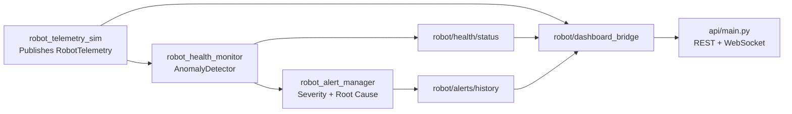

# ROS 2 Robot Health Monitoring and Anomaly Detection

Real-time ROS 2 monitoring system that simulates robot telemetry, detects anomalous behavior, and publishes health intelligence for diagnostics and preventive maintenance workflows.

This project is designed as a strong robotics software portfolio artifact: it demonstrates ROS 2 architecture, data-driven fault detection, modular package design, automated testing, and deployment readiness.

## Why this project stands out

- **Robotics-first implementation**: built as ROS 2 nodes and launch pipeline, not a generic web demo
- **Operationally relevant telemetry**: battery, actuator, vibration, controller resource metrics, and fault codes
- **Multi-strategy anomaly detection**: threshold, drift, transient spike, and fault-code classification
- **Clean modular architecture**: interfaces, simulation, detection, alert orchestration, and dashboard bridge are separated
- **Engineering signal**: YAML-driven config, unit tests, Docker scaffolding, and API extensibility

## System architecture



## ROS 2 package breakdown

| Package | Responsibility | Key output |
|---|---|---|
| `robot_interfaces` | Custom message contracts | `RobotTelemetry`, `RobotAlert` |
| `robot_telemetry_sim` | Simulates realistic robot telemetry + periodic injected faults | `/robot/telemetry` |
| `robot_health_monitor` | Evaluates telemetry and publishes anomaly alerts + health status | `/robot/alerts/raw`, `/robot/health/status` |
| `robot_alert_manager` | Aggregates alert stream, enriches with metadata, keeps recent history | `/robot/alerts/stream`, `/robot/alerts/history` |
| `robot_dashboard_bridge` | Consolidates ROS topics into dashboard/API-friendly JSON | `/robot/dashboard/json` |
| `robot_bringup` | Launches the end-to-end monitoring pipeline | `robot_health_system.launch.py` |

## Telemetry signals

The simulator publishes:

- battery level
- motor temperature
- joint velocity
- current draw
- vibration
- controller error code
- CPU load
- memory usage

## Detection methodology

Implemented in `ros2_ws/src/robot_health_monitor/robot_health_monitor/detector.py`.

1. **Threshold violations**
   - immediate checks against safe operating bounds from `config/thresholds.yaml`
2. **Drift detection**
   - moving-average baseline comparison to capture gradual degradation
3. **Spike detection**
   - transient jump detection using a configurable multiplier over recent baseline
4. **Fault-code classification**
   - maps controller error codes into warning/critical severity tiers

## Repository structure

```text
.
|- api/
|- config/
|  `- thresholds.yaml
|- ros2_ws/
|  `- src/
|     |- robot_interfaces/
|     |- robot_telemetry_sim/
|     |- robot_health_monitor/
|     |- robot_alert_manager/
|     |- robot_dashboard_bridge/
|     `- robot_bringup/
`- tests/
```

## Quick start

### Prerequisites

- ROS 2 Humble or Iron
- Python 3.10+ (or ROS-compatible Python on your distro)
- `colcon`

### 1) Install Python dependencies

```bash
python -m venv .venv
```

Linux/macOS:

```bash
source .venv/bin/activate
pip install -r requirements.txt
```

Windows PowerShell:

```powershell
.venv\Scripts\Activate.ps1
pip install -r requirements.txt
```

### 2) Build the ROS 2 workspace

Linux/macOS:

```bash
cd ros2_ws
colcon build
source install/setup.bash
```

Windows PowerShell:

```powershell
cd ros2_ws
colcon build
.\install\setup.ps1
```

### 3) Launch the health monitoring system

```bash
ros2 launch robot_bringup robot_health_system.launch.py
```

### 4) Optional: run API bridge

```bash
uvicorn api.main:app --host 0.0.0.0 --port 8000
```

API endpoints:

- `GET /health`
- `GET /api/v1/snapshot`
- `GET /api/v1/history`
- `POST /api/v1/ingest`
- `WS /ws/live`

## Configuration

All detector thresholds and strategy settings are configurable in:

- `config/thresholds.yaml`

You can override detector config at launch time:

```bash
ros2 launch robot_bringup robot_health_system.launch.py config_path:=/absolute/path/to/thresholds.yaml
```

## Testing

Run tests from repository root:

```bash
python -m pytest -q
```

Current test coverage includes:

- threshold anomaly detection
- drift detection after warmup windows
- spike detection behavior
- error code severity classification

## Docker

Build and run with Docker Compose:

```bash
docker compose up --build
```

Included services:

- monitor container (ROS 2 app scaffold)
- PostgreSQL container (for Phase 3 persistence extension)

## Roadmap

### Phase 1 (implemented)

- telemetry simulation publisher
- anomaly detector subscriber
- alert generation and health status stream
- launch file to run full ROS pipeline

### Phase 2 (implemented)

- custom ROS 2 messages
- YAML-driven thresholds
- unit tests for detection logic
- Docker setup and architecture-first README

### Phase 3 (planned)

- persist telemetry and alerts to PostgreSQL
- expose historical analytics through FastAPI services
- React dashboard with live charts and alert timeline
- trend analysis and downloadable diagnostics reports

## Tech stack

- ROS 2 (`rclpy`)
- Python
- FastAPI
- Pytest
- Docker / Docker Compose
- PostgreSQL (optional extension path)

## License

MIT
